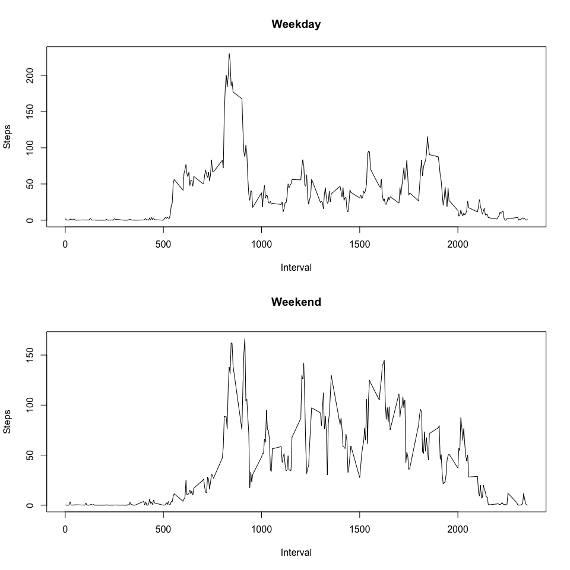

# Reproducible Research: Peer Assessment 1


## Loading and preprocessing the data

Unzipping the data 

```r
zip_file <- "./activity.zip"
unzip(zip_file, overwrite=TRUE)
```

Read the data and assign to activity_data variable

```r
activity_data <- read.csv("./activity.csv")
```

Convert factor to Date for activity_data[,"date"]

```r
activity_data[,"date"] <- as.Date(activity_data[,"date"], format="%Y-%m-%d")
```

## What is mean total number of steps taken per day?

```r
total_step_per_day <- aggregate(steps ~ date, data=activity_data, sum, na.rm=TRUE)
total_step_per_day
```

```
##          date steps
## 1  2012-10-02   126
## 2  2012-10-03 11352
## 3  2012-10-04 12116
## 4  2012-10-05 13294
## 5  2012-10-06 15420
## 6  2012-10-07 11015
## 7  2012-10-09 12811
## 8  2012-10-10  9900
## 9  2012-10-11 10304
## 10 2012-10-12 17382
## 11 2012-10-13 12426
## 12 2012-10-14 15098
## 13 2012-10-15 10139
## 14 2012-10-16 15084
## 15 2012-10-17 13452
## 16 2012-10-18 10056
## 17 2012-10-19 11829
## 18 2012-10-20 10395
## 19 2012-10-21  8821
## 20 2012-10-22 13460
## 21 2012-10-23  8918
## 22 2012-10-24  8355
## 23 2012-10-25  2492
## 24 2012-10-26  6778
## 25 2012-10-27 10119
## 26 2012-10-28 11458
## 27 2012-10-29  5018
## 28 2012-10-30  9819
## 29 2012-10-31 15414
## 30 2012-11-02 10600
## 31 2012-11-03 10571
## 32 2012-11-05 10439
## 33 2012-11-06  8334
## 34 2012-11-07 12883
## 35 2012-11-08  3219
## 36 2012-11-11 12608
## 37 2012-11-12 10765
## 38 2012-11-13  7336
## 39 2012-11-15    41
## 40 2012-11-16  5441
## 41 2012-11-17 14339
## 42 2012-11-18 15110
## 43 2012-11-19  8841
## 44 2012-11-20  4472
## 45 2012-11-21 12787
## 46 2012-11-22 20427
## 47 2012-11-23 21194
## 48 2012-11-24 14478
## 49 2012-11-25 11834
## 50 2012-11-26 11162
## 51 2012-11-27 13646
## 52 2012-11-28 10183
## 53 2012-11-29  7047
```

Make a histogram of the total number of steps taken each day


```r
hist(total_step_per_day$steps, main="Total number of steps taken each day", col="blue" )
```

 


Calculate and report the mean and median of the total number of steps taken per day

```r
mean(total_step_per_day$steps, na.rm=TRUE)
```

```
## [1] 10766.19
```


```r
median(total_step_per_day$steps, na.rm=TRUE)
```

```
## [1] 10765
```

## What is the average daily activity pattern?

Make a time series plot (i.e. type = "l") of the 5-minute interval (x-axis) and the average number of steps taken, averaged across all days (y-axis)


```r
interval_aggr <- aggregate(steps ~ interval, data = activity_data, mean, na.rm=TRUE)
plot(steps ~ interval, type = "l", data=interval_aggr, col="blue" )
```

 


Which 5-minute interval, on average across all the days in the dataset, contains the maximum number of steps?


```r
row_number <- which.max(interval_aggr$steps)
```

Therefore, interval 835 has the max number of steps which is 206.1698113


## Imputing missing values

Calculate and report the total number of missing values in the dataset (i.e. the total number of rows with NAs)

```r
is_na_table <- table(is.na(activity_data$steps))
```
Total number of missing values: 2304


Devise a strategy for filling in all of the missing values in the dataset. The strategy does not need to be sophisticated. For example, you could use the mean/median for that day, or the mean for that 5-minute interval, etc.


```r
#make a copy of the activity_data
activity_data_withNAfilled <- activity_data 

#loop through row by row
for(i in 1:nrow(activity_data_withNAfilled)){
  #We only need to work on NA 
  if(is.na(activity_data_withNAfilled[i,"steps"])){
    #fill the NA value with the mean of interval 
    activity_data_withNAfilled[i,"steps"] <- interval_aggr[interval_aggr$interval==activity_data_withNAfilled[i,"interval"],"steps"]
  }
}

#Proof there is no more NA
table(is.na(activity_data_withNAfilled$steps))
```

```
## 
## FALSE 
## 17568
```

Make a histogram of the total number of steps taken each day 

```r
total_step_per_day2 <- aggregate(steps ~ date, data=activity_data_withNAfilled, sum, na.rm=TRUE)
hist(total_step_per_day2$steps, main="Total number of steps taken each day ", col="red" )
```

 

mean

```r
mean(total_step_per_day2$steps, na.rm=TRUE)
```

```
## [1] 10766.19
```

medium

```r
median(total_step_per_day2$steps, na.rm=TRUE)
```

```
## [1] 10766.19
```


## Are there differences in activity patterns between weekdays and weekends?


Create a new factor variable in the dataset with two levels – “weekday” and “weekend” indicating whether a given date is a weekday or weekend day.


```r
#Create a new variable called day, weekdays would return Monday, Tuesday.... 
activity_data_withNAfilled$day <- weekdays(activity_data_withNAfilled$date)

weekday_or_weekend <- function(day){
  if(day == "Saturday" || day == "Sunday")
    "weekend"
  else
    "weekday"
}  

#Loop through the list, add a variable to indicate if it is a weekday or not
activity_data_withNAfilled$weekday_weekend <- sapply(activity_data_withNAfilled$day, weekday_or_weekend)
```


Make a panel plot containing a time series plot (i.e. type = "l") of the 5-minute interval (x-axis) and the average number of steps taken, averaged across all weekday days or weekend days (y-axis). See the README file in the GitHub repository to see an example of what this plot should look like using simulated data.


```r
weekday_weekend_aggr <- aggregate(steps ~ interval + weekday_weekend, data=activity_data_withNAfilled,mean)

par(mfrow=c(2,1))

#Weekday plot
  plot(x=weekday_weekend_aggr[weekday_weekend_aggr$weekday_weekend=="weekday",]$interval, y = weekday_weekend_aggr[weekday_weekend_aggr$weekday_weekend=="weekday",]$steps, type="l", main="Weekday", xlab="Interval", ylab="Steps")

  plot(x=weekday_weekend_aggr[weekday_weekend_aggr$weekday_weekend=="weekend",]$interval, y = weekday_weekend_aggr[weekday_weekend_aggr$weekday_weekend=="weekend",]$steps, type="l", main="Weekend
       ", xlab="Interval", ylab="Steps")
```

 
